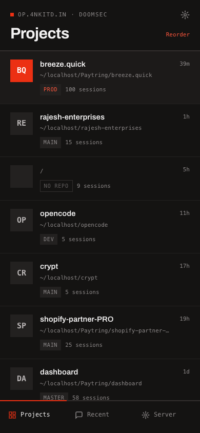
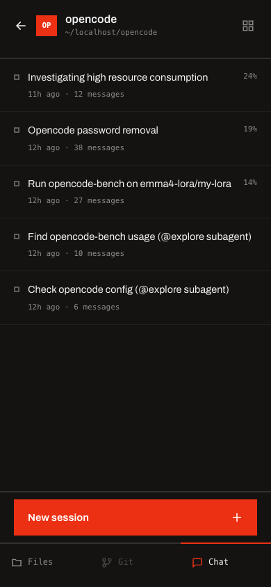
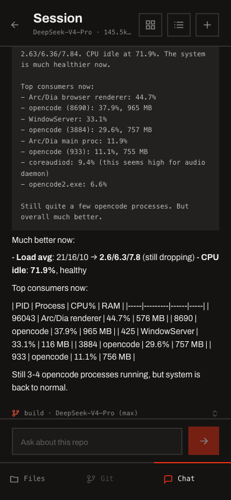
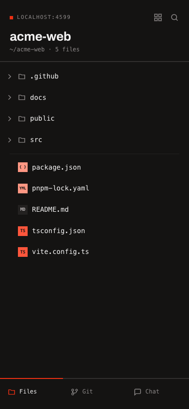
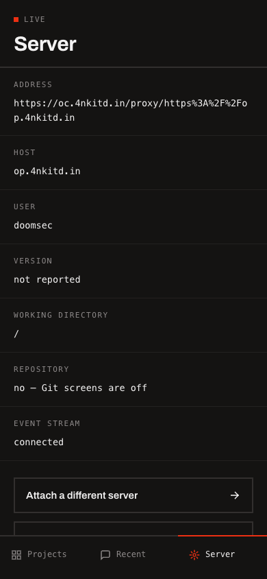
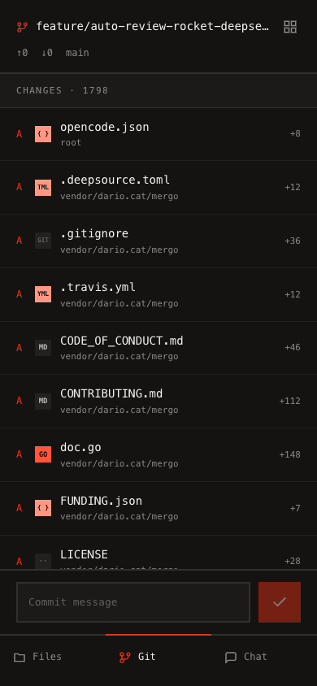

# ocean

Mobile-first web client for a running `opencode serve` (v2) process.

**Live: https://oc.4nkitd.in**

Standalone Vue 3 + Vite + TypeScript SPA — shares no code with the SolidJS
interface. Talks to the opencode server over its HTTP API and SSE event stream.

## Screenshots

| Projects | Sessions | Chat |
|---|---|---|
|  |  |  |

| Files | Server | Git |
|---|---|---|
|  |  |  |

## Features

- Connect to any reachable v2 server (LAN or tunneled) with its mandatory
  basic auth — username `opencode`, password from `OPENCODE_PASSWORD`
- Same-origin relay (`/proxy/…`), default-on when the app is not on localhost:
  v2 only allows CORS from localhost and `*.opencode.ai`, so the relay is the
  only way a deployed build can talk to a server
- Projects / Recent / Server tabs with one-tap server switching
- Session chat with live streaming: reasoning blocks, tool calls with
  expandable output, agent / model / variant selection
- File tree with lazy loading, filter, and code viewer with changed-line tint
- Git screens: status, diff and commit history from the server's read-only VCS
  API, with commit/push run as real `git` through the server's shell endpoint
- Terminal drawer on <kbd>Ctrl</kbd>+<kbd>`</kbd> (or the button beside the
  session title): commands run through the server's shell endpoint with output
  streamed live, `Ctrl+C` to kill, and `cd` tracked between commands
- Multi-server management, PWA manifest, dark/light/system themes, and normal
  or high contrast modes in Server settings

## Setup

To run the server the app talks to — install opencode, run it as a background
service, protect it with basic auth, and expose it through a Cloudflare
Tunnel — see **[docs/setup.md](docs/setup.md)**. It includes both the manual
steps and a ready-to-paste prompt you can hand to your agent to do the whole
setup for you.

## Develop

```sh
cd packages/mobile
npm install
npm run dev          # http://localhost:5173
npm run build        # typecheck + production build
```

To exercise the app against a real v2 server, run `opencode serve` locally and
connect with the relay off:

```sh
OPENCODE_PASSWORD=test123 opencode2 serve --hostname 127.0.0.1 --port 8080
# connect from the app: http://127.0.0.1:8080, basic auth opencode:test123
```
